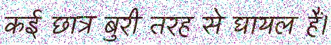

# Indic Imagen 
[]()

[View Changelog](CHANGELOG.md)

[]() []() []()

A Python script to generate synthetic OCR training data from text or tabular dataset. This python script has been purposefully been designed for Indian Brahmi scripts such as Devanagari, Tamil, Telugu, Kannada, Malayalam, Bengali and others. It helps in generating high quality synthetic images. 

This tool is a practical implementation of the paper: [OCR Synthetic Benchmark Dataset for Indic Languages](https://arxiv.org/abs/2205.02543)

##  Key Features

- Generate 3 classes of synthetic images :
    - **CLASS 1** : Clean Text with solid backgrounds. 
    - **CLASS 2** : Clean Text with random image backgrounds. 
    - **CLASS 3** : Scanned Document Simulation. 

- Color Options :
    - **WCAG 2.0 AAA Compliant** : 90 color pairs
    - **Base Paper** : 30 color pairs

- Image Customization :
    - **Image Dimensions** : Height and DPI
    - **Noise levels and Types** : Gaussian, Salt and Pepper, Speckle and Poisson.
    - **Blur Effects**
    - **Multi-Thread Support**

- Interactive Progress Tracking and Storage Management

- CSV Output mapping for generated images

## Installation 

To install and run the script,

- Clone the repo to your desired location,

```bash
git clone https://github.com/adityawardhanm/indic_imagen
```

- enter the cloned repo 

```bash 
cd /indic_imagen
```

- Install the requirements
```bash
pip install -r requirements.txt
```

## Usage and Configuration

- Prepare assets :
    - Data file : ```.txt```, ```.csv```, ```.xlsx```
    - Background : Add Images for class 2/3 
    - Fonts : Add ```.ttf```, ```.otf```
- Run the program 
```bash
streamlit run app.py
```
- Configure : 
    - Add the file path for the data source
    - Set Max Character Length (This is for controlling length of the line being generated)
    - Set Height (in px)
    - Set DPI for Resolution
    - Set Max Storage to control the amount of storage being utilized
    - Enable Multi-Threading for faster processing
    - Select Classes you want to use
        - **CLASS 1** : Clean Text with solid backgrounds. 
        
        - **CLASS 2** : Clean Text with random image backgrounds. 
        
        - **CLASS 3** : Scanned Document Simulation. 
        

## Output Structure

The generated images and their metadata are stored in the following structure:

```bash
generated_images/
├── class1/       # Solid background images
├── class2/       # Background images with text
└── class3/       # Noisy scanned documents
image_mappings.csv  # Metadata (path, text, font, class)
```

## Troubleshooting

- Generating large datasets can consume significant storage. Monitor disk space usage accordingly.
- The files are stored in the same location as the script.
- **Supported formats**:
    - **Fonts**: .ttf, .otf
    - **Background Images**: .jpeg, .png
- For data source, please provide absolute path only.
- If you encounter slow generation speeds, Enable Multi-Threading. 
- **Pro tip**: For generation above 100K images, use an ssd and above 16GB+ RAM


## Contribution Guidelines

Currently, the project is in early development, so contributions are not open yet. The script and Streamlit wrapper are also not **PEP 8 Compliant**. Once the program reaches a stable state, it will be released as a package for installation via ```pip``` and GitHub. Contributions will be welcomed at that stage.

## License Information

The Script is licensed under the **MIT License**.

## Acknowledgement

At present, I am the sole developer of this project. Since the project is still under active development, I am not accepting donations. However, once optimizations, GPU integration, and further improvements are complete, I will provide a **Buy Me a Coffee** link.

